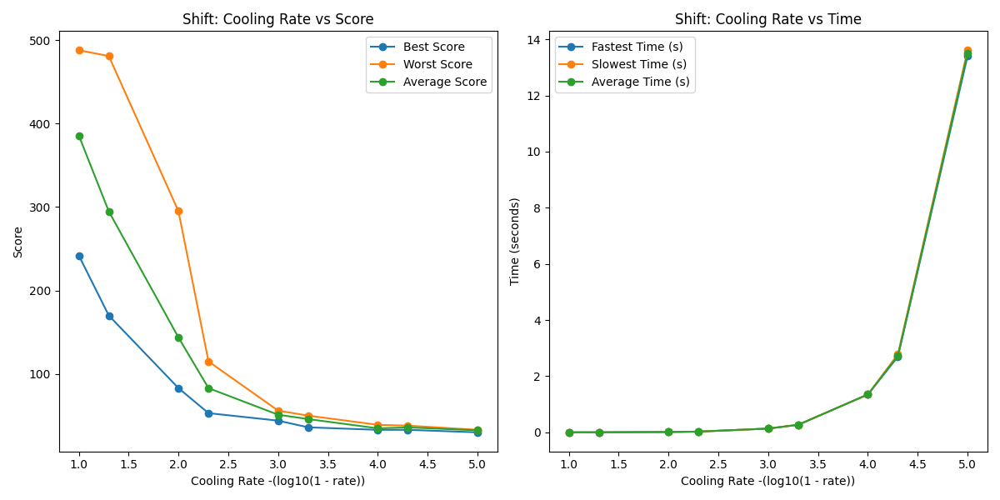

# Simulated Annealing - Lab 04

A basic implementation of simulated annealing for FPGA CLB (Configurable Logic Block) placement optimization. Features multiple mutation strategies, real-time visualization, and performance analysis tools.

## Overview

This project implements simulated annealing to solve the FPGA placement problem - optimally positioning connected logic blocks on a 2D grid to minimize wire length. The system is built in C++17 for performance-critical algorithms, with optional Python integration for advanced visualization and analysis.

**Key Architecture:**

- **Core Engine**: C++17 implementation with multiple mutation algorithms
- **Visualization**: Optional embedded Python with real-time updates
- **Analysis**: Comprehensive performance metrics and comparative studies
- **Cross-Platform**: Supports Windows, Linux, and macOS

## Features

### Core Algorithm

- **Multiple Mutation Methods**: Naive, Conway, Shift, and Centroid-based strategies
- **Adaptive Cooling**: Configurable temperature schedules and cooling rates
- **Performance Optimized**: Compressed Sparse Row (CSR) graph representation
- **Thread-Safe**: Asynchronous visualization with proper synchronization

### Visualization System

- **Real-Time Grid**: Live placement updates during annealing process
- **Graph Visualization**: Network topology with directed edges and node positioning
- **Statistics Dashboard**: Temperature, score trends, and acceptance rates
- **Export Capabilities**: High-resolution PNG and animated GIF output

### Analysis & Benchmarking

- **Multi-Method Comparison**: Side-by-side algorithm performance analysis
- **Parameter Studies**: Cooling rate and temperature sensitivity analysis
- **Statistical Reports**: Detailed CSV output and markdown summaries
- **Convergence Metrics**: Track optimization progress and solution quality

## Requirements

### Essential

- **C++17** compatible compiler (GCC 7+, Clang 6+, MSVC 2019+)
- **Make** build system
- **Standard libraries**: `<filesystem>`, `<thread>`, `<chrono>`, etc.

### Optional (for visualization)

- **Python 3.8+** (tested with 3.12)
- **Python packages**: PyQt5, pyqtgraph, numpy, imageio, scipy, networkx, matplotlib, pandas

### Platform-Specific

- **Linux**: `build-essential` package
- **Windows**: MinGW-w64 or Visual Studio 2019+
- **macOS**: Xcode Command Line Tools

## IMPORTANT !!

I've noticed that cygwin has **severe** troubles installing the required packages for visualization. To get the required packages takes an imense ammount of space, and is very prone to failing. I'd reccomend using the command `make <target> USE_PYTHON=0` whenever you build, because it's a pain in the neck to get it to run otherwise. Similarly, running on Powershell or cmd.exe will produce troubles because of the PyQt5 dependency. I'd reccomend the same stragegy. Otherwise, it should work fine.

If you do want to try and build on cygwin, I found that at LEAST the following installation packages are required to build, though I could never get a working version done.

- curl
- wget
- gcc-core
- g++-core
- gcc-g++
- libQt5Core-devel
- libQt5Gui-devel
- python3X-cython (X is just your version of Python, but it MUST match `python -V`)
- python3X-devel
- python3X-pip
- python3X-setuptools
- python3X-virtualenv
- python3X-wheel
- qt5-devel-tools
- ninja
- meson
- make (a bit obvious there)

I'm positive there are more gotchas, so I wouldn't recomend trying to build with visualization in Cygwin. However, the pure CLI is tested and stable in Cygwin.

## Quick Start

```bash
# 1. Clone or download the repository
git clone <repository-url>
cd Lab04

# 2. Build the project
make

# 3. Run with default settings
make run

# 4. Run with custom input
make run INPUT=demo.txt OUTPUT=results.txt

# 5. Run with visualization (requires Python)
./build/bin/Lab04 demo.txt output.txt --plot grid,graph,stats
```

## Project Structure

```
Lab04/
├── src/                    # C++ source files
│   ├── main.cpp           # Entry point and CLI handling
│   ├── Graph.cpp          # Graph data structure and operations
│   ├── simulateAnnealing.cpp # Core annealing algorithms
│   ├── util.cpp           # Utility functions
│   └── pyViz.cpp          # Python integration (optional)
├── include/               # Header files
├── scripts/               # Python visualization modules
│   ├── Viz.py            # Main visualization orchestrator
│   ├── AnimatedGrid.py   # Real-time grid display
│   ├── BasicDigraph.py   # Graph network visualization
│   └── StatsGraph.py     # Performance metrics plots
├── data/                  # Input files and results
│   ├── demo.txt          # Example problem instance
│   └── *.csv            # Analysis results
├── build/                 # Compiled objects and executables
└── makefile              # Build configuration
```

### Building

### Make Targets

The makefile provides several convenient targets:

- **`make` or `make all`**: Build the executable and all object files
- **`make run`**: Build and run with default arguments (`input.txt output.txt`)
- **`make run-full`**: Build and run with all flags enabled except for running analysis
- **`make run-analysis`**: Build and run the analsys of cooling rate versus duration and solution quality
- **`make setup`**: Runs the setup script to ensure that the desired python packages are installed
- **`make clean`**: Remove all build artifacts
- **`make help`**: Display available options and usage

### Manual Compilation

If you prefer to compile manually or the makefile doesn't work for your system, you can also the compiler of your choice directly. For clang++ and g++, the command is identical. Simply navigate to the project root, and run the following:

```bash
# Basic compilation (no Python visualization)
g++ -std=c++17 -Wall -Wextra -O3 -Iinclude \
    src/Graph.cpp src/main.cpp src/simulateAnnealing.cpp src/util.cpp \
    -o Lab04

# With Python visualization support
g++ -std=c++17 -Wall -Wextra -O3 -Iinclude -DHAVE_PYTHON \
    src/Graph.cpp src/main.cpp src/simulateAnnealing.cpp src/util.cpp src/pyViz.cpp \
    -lpython3.12 -o Lab04
```

**Important Notes:**

- The project uses C++17 `<filesystem>` library - ensure your compiler supports this
- **Linux**: Install `build-essential` package for GCC/development tools
- **Windows**: Use [MinGW-w64](https://www.mingw-w64.org/) or [Visual Studio](https://visualstudio.microsoft.com/downloads/)
- **macOS**: Install Xcode Command Line Tools

**Recommended Compiler Flags:**

- `-Wall -Wextra`: Enable comprehensive warnings
- `-std=c++17`: C++17 standard compliance
- `-O3`: Optimization for release builds
- `-g -O0`: Debug symbols for debugging builds

**MSVC Compilation:**

If you use MSVC as your chosen compiler, the flags will look a bit different. Run the following:

```cmd
cl /std:c++17 /W4 /EHsc /I include src\Graph.cpp src\main.cpp src\simulateAnnealing.cpp src\util.cpp /Fe:Lab04.exe
```

**Note**: Windows compilation with Python support requires additional Python development libraries and linking flags.

**Preferred Method**: Use the provided makefile for automatic dependency management and platform detection.

#### Make Run Options

Customize the `make run` target with these variables:

- **`ARGS`**: Complete command line arguments
- **`INPUT`**: Input file (default: `input.txt`)
- **`OUTPUT`**: Output file (default: `output.txt`)
- **`MUTATION_METHOD`**: The desired method of mutating the solution [`naive`, `conway`, `shift`, or `centroid`]
- **`PLOT_TYPE`**: The type of plots generated [`grid`, `graph`, or `stats`; `all` uses all types]
- **`SAVE_FIGS`**: Whether or not to save he figures generated [`true` or `false`]
- **`FIGURE_PATH`**: The path to save figures at (default: `./`)
- **`RUN_ANALYSIS`**: Whether to run analysis on cooling rate versus time and solution quality [`true` or `false`]

**Examples:**

```bash
make run INPUT=demo.txt OUTPUT=results.txt
make run ARGS="demo.txt output.txt --plot-type=grid --mutation-method=centroid"
make run RUN_ANALYSIS=true
```

### Command Line Usage

```bash
./Lab04 <input_file> <output_file> [--plot-type=<types>] [--mutation-method=<algorithm>]
       [--save-figures=<boolean>] [--figure-path=<path>] [--run-analsys=<boolean>]
```

**Arguments:**

- `input_file`: Problem instance file (see Input Format below)
- `output_file`: Results output location
- `--plot-type=<types>`: Comma-separated visualization types: `grid`, `graph`, `stats`, `all`
- `--method <algorithm>`: Algorithm choice: `naive`, `conway`, `shift`, `centroid`
- `--save-figures=<boolean>`: Whether or not to save he figures generated: `true` or `false`
- `--figure-path=<path>`: The path to save figures at (defaults to current directory)
- `--run-analsys=<boolean>`: Run comprehensive performance analysis: `true` or `false`

**Examples:**

```bash
# Basic run with default settings
./Lab04 data/demo.txt results.txt

# With real-time visualization
./Lab04 data/demo.txt results.txt --plot-type=all

# Compare algorithms
./Lab04 data/demo.txt results.txt --mutation-method=centroid

# Performance analysis
./Lab04 data/demo.txt results.txt --run-analysis
```

## Input File Format

Input files specify the graph topology and grid constraints:

```
# Grid dimensions and graph size
g <grid width> <grid height>
v <number of vertices>

# Graph edges (source -> destination)
e <vertex1> <vertex2>
e <vertex3> <vertex4>
...
```

**Example (`data/demo.txt`):**

```
g 5 5
v 1

e 0 2
e 1 2
e 2 3
e 3 4
e 3 5
```

## Algorithm Details

### Mutation Methods

1. **Naive**: Random swapping of vertices or empty positions
2. **Conway**: Game of Life inspired cellular automaton rules. Occupied pixels are surrounded by padded pixels, which form the set of feasible destination locations
3. **Shift**: Systematic shifting of a random vertex to the place minimizing it's highest edge. Radiates out if the "idea" position is filled with some probability to replace.
4. **Centroid**: Move vertices toward centroids of their neighbors

## Analysis & Results

The `--analysis` flag generates an analisys of different cooling rates against the solution speed and quality

- **Multi-algorithm comparison** across different cooling rates
- **CSV output** for further data analysis
- **Markdown reports** with summary statistics

Analysis results are saved to:

- `data/annealing_analysis_<method>.csv` - Raw performance data
- `docs/annealing_analysis.md` - Summary report

Using the `view-analysis.py` script, you can view comparison of cooling rates on duration and solution quality. The plots currenly live under the `docs/` directory and look like the following



## Visualization Features

When built with Python support, the system provides:

### Real-Time Grid View

- Live vertex placement updates during annealing
- Color-coded vertices with adaptive sizing
- Checkerboard background for clear grid visualization
- Score and temperature display

### Graph Network View

- Automatic graph layout using NetworkX
- Vertex labels and size correlation
- Image export capabilities

### Statistics Dashboard

- Multi-tab performance metrics
- Temperature cooling curves
- Score evolution and best-score tracking
- Acceptance rate trends
- Capable of exporting to a PNG

## Troubleshooting

### Build Issues

- **"filesystem not found"**: Ensure C++17 support (`-std=c++17`)
- **Python linking errors**: Verify Python dev packages installed
- **Make not found**: Install build tools for your platform

### Runtime Issues

- **"Cannot find input file"**: Check file paths relative to project root
- **Visualization crashes**: Ensure Python dependencies installed in venv
- **Poor performance**: Try different mutation methods or adjust temperature

### Platform-Specific Notes

- **Linux**: May need `sudo apt install python3-dev` for Python integration
- **Windows**: Use forward slashes in file paths or escape backslashes
- **macOS**: Ensure Xcode command line tools installed

## Contributing


Why would you want to contribute to this?

## AI usage

This project relied little on AI for the C++ portion regarding the logic following simulated annealing. I claim all work as my own for that portion, though there were conversations about optimizations and strucutre. The actual logic is mine though. The Python visualization was heavily reliant on AI. I'm not as familiar with the Python C API nor PyQtGraph. Because of this, I relied on them for syntax, available resources, and formatting.
